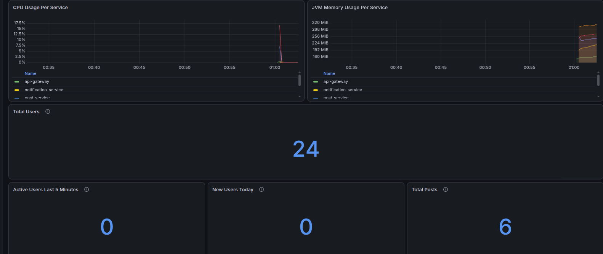

# Rione

Rione is a didactic microservices project. The local setup runs the backend services with Docker Compose and exposes the public API through the API Gateway.

## Requirements

- Java 21
- Docker and Docker Compose v2
- Maven Wrapper from this repository
- Node.js and npm

## Local Configuration

You can run the project with the default local credentials, or create a `.env` file in the project root to override them:

```env
USER_SERVICE_DB_USERNAME=postgres
USER_SERVICE_DB_PASSWORD=password
SOCIAL_SERVICE_DB_USERNAME=postgres
SOCIAL_SERVICE_DB_PASSWORD=password
PGADMIN_DEFAULT_EMAIL=admin@example.com
PGADMIN_DEFAULT_PASSWORD=password
RIONE_SERVICE_JWT_SECRET=change-this-demo-service-secret-key-1234567890
GRAFANA_ADMIN_USER=admin
GRAFANA_ADMIN_PASSWORD=admin
```

The `.env` file is ignored by Git and is intended only for local development.

## Local Seed Data

The local user dataset is documented in `state.md`, which is ignored by Git so it can stay in sync with local manual tests without polluting the repository history.

## Start the Backend

From the project root, build and start all backend containers:

```bash
docker compose up --build
```

Run in detached mode if you want to keep using the same terminal:

```bash
docker compose up -d --build
```

Main local URLs:

```text
API Gateway:    http://localhost:8080
User Service:   http://localhost:8081
Social Service: http://localhost:8082
Post Service:   http://localhost:8083
Notification:   http://localhost:8084
Prometheus:     http://localhost:9090
Grafana:        http://localhost:3000
pgAdmin:        http://localhost:5050
```

Stop the backend:

```bash
docker compose down
```

Stop the backend and remove local database volumes:

```bash
docker compose down -v
```

## Start the Frontend

The frontend is a React/Vite application in `frontend/`.

Install dependencies:

```bash
cd frontend
npm ci
```

Start the local development server:

```bash
npm run dev
```

Open the frontend at:

```text
http://localhost:5173
```

By default, the frontend calls the API Gateway at `http://localhost:8080`. To use a different backend URL, start Vite with `VITE_API_BASE_URL`:

```bash
VITE_API_BASE_URL=http://localhost:8080 npm run dev
```

### Frontend Screenshots

The React frontend is used as a practical test client for the complete application flow through the API Gateway.


## Swagger / OpenAPI

Open the API Gateway Swagger UI:

```text
http://localhost:8080/swagger-ui.html
```

The Swagger UI contains the available public API groups:

```text
user-service
social-service
post-service
notification-service
```

Raw OpenAPI documents are also available through the gateway:

```text
http://localhost:8080/users/v3/api-docs
http://localhost:8080/social/v3/api-docs
http://localhost:8080/posts/v3/api-docs
http://localhost:8080/notifications/v3/api-docs
```

The static OpenAPI contract files are stored in:

```text
docs/openapi/
```

## Health Checks

The backend services expose Spring Boot Actuator health endpoints.

```text
API Gateway:    http://localhost:8080/actuator/health
User Service:   http://localhost:8081/actuator/health
Social Service: http://localhost:8082/actuator/health
```

Example:

```bash
curl http://localhost:8080/actuator/health
```

Expected response when the service is running:

```json
{
  "status": "UP"
}
```

The gateway health endpoint reports the gateway status. To check the whole local backend, call the health endpoint of each service.

## Metrics, Prometheus, and Grafana

The services expose Prometheus-compatible metrics through Spring Boot Actuator:

```text
API Gateway:          http://localhost:8080/actuator/prometheus
User Service:         http://localhost:8081/actuator/prometheus
Social Service:       http://localhost:8082/actuator/prometheus
Post Service:         http://localhost:8083/actuator/prometheus
Notification Service: http://localhost:8084/actuator/prometheus
```

Start the monitoring stack together with the backend:

```bash
docker compose up -d --build
```

Prometheus is available at:

```text
http://localhost:9090
```

Grafana is available at:

```text
http://localhost:3000
```

Default local Grafana credentials are `admin` / `admin`. Override them with `GRAFANA_ADMIN_USER` and `GRAFANA_ADMIN_PASSWORD` in `.env`.

The Prometheus datasource and the `Rione Microservices` dashboard are provisioned automatically from:

```text
monitoring/grafana/provisioning/
monitoring/grafana/dashboards/rione-services-dashboard.json
```

Open Grafana, go to Dashboards, then open the `Rione / Rione Microservices` dashboard. No manual import is needed when using Docker Compose.

Dashboard examples:




Prometheus scrapes all local microservices from `monitoring/prometheus/prometheus.yml`. The dashboard visualizes:

```text
HTTP request rate:       http_server_requests_seconds_count
Average response time:   http_server_requests_seconds_sum / http_server_requests_seconds_count
HTTP 4xx/5xx error rate: http_server_requests_seconds_count filtered by status
Service uptime:          process_uptime_seconds
CPU usage:               process_cpu_usage
Memory usage:            jvm_memory_used_bytes
Registered users:        rione_registered_users
```

The `rione_registered_users` business metric is currently exposed by user-service. The technical metrics are exposed by each service.

## Run Tests

Run all tests and build checks:

```bash
./mvnw -B verify
```

Run only the social service checks:

```bash
./mvnw -B -pl services/social-service -am test
```

Run only the user service checks:

```bash
./mvnw -B -pl services/user-service -am test
```
